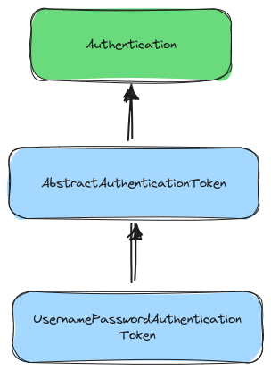

# SpringSecurityにおけるAuthenticationとは

ここ何日かSpringSecurityで遊んでいるのですが、Authenticationについて腑に落ちたのでメモを残します。

## Authentication is 何

Authenticationとは名前の通り認証を表現するもので、その実態はJavaのインターフェイスです。認証処理の過程でその実装クラスに応じ適切な認証処理を選択できる仕組みとなっています。

一般的なユーザー名/パスワードのログインケースで考えてみましょう。まず認証処理を開始するために未認証であることを示すAuthenticationを作成します。ユーザが送ってきたユーザ名/パスワードの検証に成功すれば、認証済みであることを示すAuthenticationを新たに作成します。未認証のAuthenticationを受取、認証済みのAuthenticationを返す仕事を担うのがAuthenticationProviderです。


※ 未認証のユーザを表す[AnonimousAuthenticationToken](https://spring.pleiades.io/spring-security/reference/servlet/authentication/anonymous.html)というものもあるのですが、あまり意識する必要がないのと、話が不用意に複雑になると思うのでここでは掘り下げません。

Authenticationはclassではなくinterfaceとして定義されているため何かしら実装が必要になるわけですが、これはSpringSecurityが備えているクラスを使うこともできますし独自に定義することもできます。


Authenticationの定義は次のとおりです。

``` java
public interface Authentication extends Principal, Serializable {
	Collection<? extends GrantedAuthority> getAuthorities();
	Object getCredentials();
	Object getDetails();
	Object getPrincipal();
	boolean isAuthenticated();
	void setAuthenticated(boolean isAuthenticated) throws IllegalArgumentException;
}
```

https://github.com/spring-projects/spring-security/blob/040b87911946b40d290141b93bdee20a54391c34/core/src/main/java/org/springframework/security/core/Authentication.java

認証済みかどうかは `isAuthenticated()` メソッドで確認する決まりです。

## Authentication の具体的な実装を読んでみよう

インターフェイスだけを眺めていてもあまりイメージがわかないので、その実装クラスにフォーカスを移してみましょう。

例えば、デフォルトのフォームログインにおいて、ユーザ名/パスワード認証をする時に使われるAuthenticationの実装は `UsernamePasswordAuthenticationToken` です。このクラスは `AbstractAuthenticationToken` クラスを継承し、間接的に `Authentication` を実装しています。



https://github.com/spring-projects/spring-security/blob/040b87911946b40d290141b93bdee20a54391c34/core/src/main/java/org/springframework/security/authentication/UsernamePasswordAuthenticationToken.java